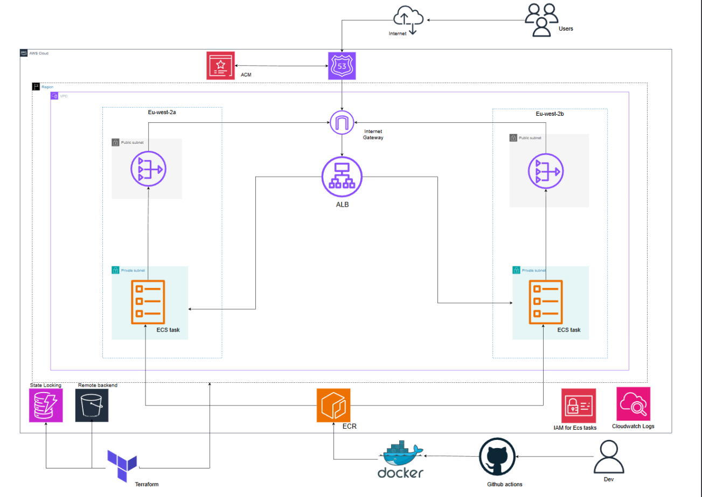

# Threat Composer on AWS

I built this as a production-style platform on AWS for a React and TypeScript threat-modelling app. I compile it to static assets and serve them with **nginx** inside a container. I manage the infrastructure with **Terraform**, and I deliver changes without long-lived AWS keys in the repo by using **GitHub OIDC**.

I ship releases with **ECS rolling deployments** to **ECS Fargate** behind an **Application Load Balancer**. I terminate **TLS** on the **ALB** with **ACM**, and I redirect HTTP to HTTPS. I keep the workloads in **private subnets** and I send **ECR**, **ECS**, **CloudWatch Logs**, and **S3** traffic through **VPC endpoints**, so I avoid **NAT** and the cost that comes with it. I split **IAM** between an **ECS task execution role** and a **GitHub Actions** role; the pipeline role trusts only my repository via **OIDC**, which keeps the blast radius for automation smaller than sharing one broad user key.

---

## Architecture

When someone opens my app URL, **Route 53** points that hostname at my **Application Load Balancer**. The load balancer terminates **TLS** with a certificate from **ACM** that I validate through DNS in the same **Route 53** zone. From there, traffic goes to a single target group that registers my **ECS Fargate** tasks. I run those tasks in **private subnets** and I do not give them public IPs.

The tasks pull images from **ECR** and write logs to **CloudWatch Logs** using the standard **ECS task execution role**. Instead of sending that traffic over the public internet through a NAT gateway, I use **VPC endpoints** for **ECR** (API and DKR), **ECS**, **CloudWatch Logs**, and **S3**. That keeps the path predictable and saves me NAT charges for those calls.

I store Terraform state for the main stack in **S3**, and I use **DynamoDB** for locking so two applies cannot clobber each other. I created the bucket, lock table, **ECR** repository, GitHub OIDC wiring, and the IAM role my pipelines assume from a separate **`bootstrap/`** Terraform project that I run once before the main stack.

### High-level architecture

The diagram below is how I picture the main pieces fitting together.



### GitHub OIDC trust setup

When I run bootstrap, Terraform defines the IAM role that **GitHub Actions** may assume. I scoped the trust policy to my repository using the OIDC `sub` claim so other repos cannot use the same role. The screenshot shows what that trust side looks like in my account.


---

## Security and guardrails

I want users to hit **HTTPS** only. I configured the load balancer with an **ACM** certificate, and I redirect plain **HTTP** to **HTTPS** so bookmarks and typos still end up on a secure connection.

I run the app containers in **private subnets** without public addresses. I only open the app port on the task security group to the **ALB** security group, so nobody can reach the tasks directly from the open internet.

For identities, **ECS** uses a **task execution role** that follows the usual pattern (for example the managed **AmazonECSTaskExecutionRolePolicy**) so tasks can pull from **ECR** and write logs. **GitHub Actions** uses a different role that I created in bootstrap; it is only assumable through **OIDC** and I scoped the trust policy to my GitHub repo.

My CI workflow can run **Trivy** against the image before push. My Terraform workflow runs **TFLint** and **Checkov** before apply, which catches a lot of misconfigurations early. I keep **`AWS_ROLE_ARN`** in GitHub secrets and I avoid committing raw AWS keys or sensitive `*.tfvars` files; my `.gitignore` helps keep those out.

---

## Getting started

### What I needed beforehand

I used an AWS account where I could create **IAM**, **VPC**, **EC2**-related pieces for the load balancer, **ECR**, **ECS**, **ELB**, **ACM**, **Route 53**, **S3**, **DynamoDB**, and **CloudWatch Logs**.

I also needed a **DNS zone** that **Route 53** (or my registrar) delegates correctly, matching the `zone_name` and `domain_name` values I set in Terraform. **ACM** had to be able to create validation records, and I needed an alias (or **A**) record pointing my app hostname at the load balancer.

On my machine I installed **Terraform** (1.6+), the **AWS CLI** (v2), **Docker**, and **Git**. When I built on Apple Silicon but ran **Fargate** on **x86_64**, I used Docker **Buildx** and built for `linux/amd64` so the image would actually run in the cluster.

I also needed GitHub access to add repository secrets and run Actions workflows.

### GitHub secret I added

I created a repository secret named **`AWS_ROLE_ARN`** whose value is the ARN of the IAM role that trusts GitHub **OIDC**; bootstrap Terraform printed that ARN after I applied it.

### How I brought the environment up

**Step one — bootstrap.** I ran this from the `bootstrap` directory: `terraform init`, then `terraform plan`, then `terraform apply`. I checked that my variable defaults (or overrides) matched the S3 bucket name I wanted for state, the DynamoDB lock table name, the **ECR** repository name (I defaulted to `threat-composer-app`), and the GitHub repository string in the OIDC trust policy.

**Step two — wire GitHub to AWS.** I copied the IAM role ARN from bootstrap into the **`AWS_ROLE_ARN`** secret. The role name in my account might look like `threat-composer-github-actions`, but I used the full ARN in the secret.

**Step three — main infrastructure.** In the `terraform` directory I ran `terraform init -reconfigure`, then `terraform plan`, then `terraform apply`. I verified the `terraform_remote_state` data source in `main.tf` pointed at the same S3 bucket and state key I used when I applied bootstrap, otherwise the stack would not see **ECR** outputs.

**Step four — build the image.** I pushed a change on `main` that touched the paths my CI workflow watches, or I ran the CI workflow manually. The pipeline built a `linux/amd64` image, optionally scanned it, and pushed tags to **ECR** (commit SHA plus `latest`).

**Step five — deploy.** I ran the **Deploy to ECS** workflow. When I left the image tag field empty, it picked the image I had pushed most recently (by push time) using its digest. When I wanted to pin an older build, I passed that tag explicitly.

---

## CI/CD and deployment flow

I split the work across three workflows so I can change infrastructure, application code, or running tasks without doing everything in one go.

My **CI** workflow (`ci.yml`) runs when I push to `main` and the changed files match its path filters. It checks out the code, assumes my AWS role through **OIDC**, logs in to **ECR**, builds my **Dockerfile** in two stages (Node build, then nginx), tags the image with the commit SHA and `latest`, runs **Trivy** where I configured it, and pushes both tags to the `threat-composer-app` repository.

My **Terraform** workflow (`terraform.yml`) only runs when I start it manually. I choose **apply** or **destroy** and I must type **CONFIRM** so I cannot wipe the stack by accident. It runs **TFLint** and **Checkov**, then `terraform init -reconfigure`, plans, and applies the plan (or plans a destroy and applies that if I chose destroy).

My **Deploy** workflow (`deploy.yml`) is also manual. It resolves which image to run, fetches the current **ECS** task definition from AWS, swaps in the new image reference, registers a new revision, updates the service with **force-new-deployment**, and waits until the service is stable again.

Today I use **ECS rolling** updates only. I did not add **CodeDeploy** blue/green in this Terraform tree, though I could add it later if I want safer cutovers.

### Workflow screenshots

Below are screenshots of how I configured the three workflows in GitHub Actions.


---

## Repository layout

The tree below is a quick map of how I organised the repo.

```
Threat-Modelling-Tool/
├── bootstrap/              # One-time foundation: S3 state, DynamoDB lock, OIDC role, ECR, CI IAM policy
├── terraform/              # Main stack: VPC, ACM, ALB, IAM (ECS execution), ECS cluster/service/task
│   └── modules/            # vpc, ACM, ALB, IAM, ECS
├── src/                    # React / TypeScript application source
├── public/                 # Static assets for CRA
├── nginx/                  # nginx config for production container
├── images/                 # README visuals (see Architecture section)
├── .github/workflows/      # ci.yml, terraform.yml, deploy.yml
├── Dockerfile              # Multi-stage build → nginx static hosting on port 80
├── package.json
├── yarn.lock
├── .gitignore
└── README.md
```


## Areas I would improve next

These are things I would add or tighten next.

 - I would consider **blue/green** or **canary** releases by adding **AWS CodeDeploy** for **ECS**.

 - I would put **AWS WAF** in front of the load balancer for another layer against common web attacks. I would start with managed rule groups and rate limiting, and I would send logs to **S3** or **CloudWatch** for review.

 - I would eventually split **dev**, **staging**, and **prod** with separate Terraform state or workspaces, separate **ECS** services, and clearer promotion rules between pipelines.

 - My VPC avoids **NAT** by using **VPC endpoints**. If I ever needed general internet egress from private subnets, I would add **NAT** and accept the monthly cost, or I would question whether I really need that path.

 - For production hardening I would turn on deletion protection for the load balancer and protect the **ECS** service from accidental teardown. My state bucket already matters a lot; I would tighten its bucket policy carefully.

---

